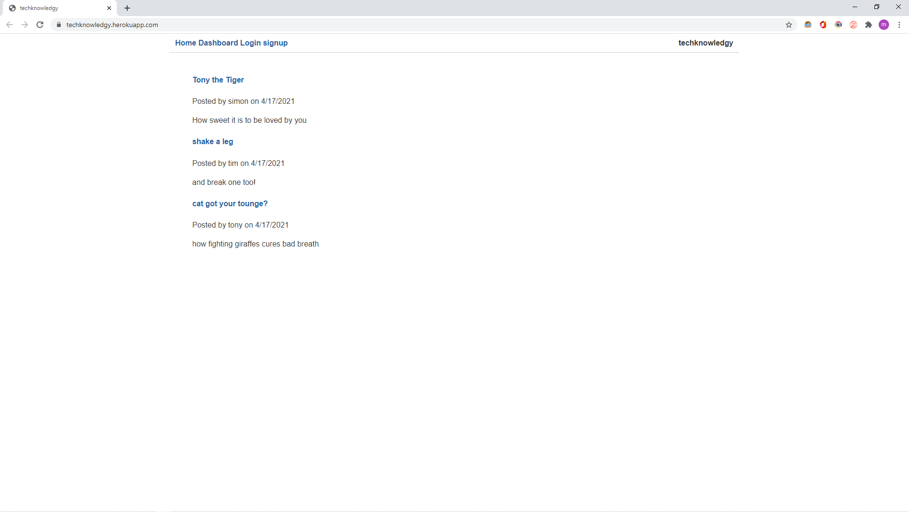

# E-commerce Back End module 13 assignment

This is a blog website where users can sign up and post about their favourite topics and respond to other peoples blog posts. 

Thank you for stopping by!

## LINK TO deployed application
https://techknowledgy.herokuapp.com/

## Resources used
1. Node.js
2. Visual Studio Code
3. Sequelize
4. mySQL2 
5. github 
6. Heroku
7. Handlebars
8. express-session
9. express-handlebars
10. express
11. dotenv
12. connect-session-sequelize

### Contact Info

Cell: 647-929-5340  
E-mail: matthewbianco@protonmail.com  
Linkedin: https://www.linkedin.com/in/matthew-bianco-a90193200/  